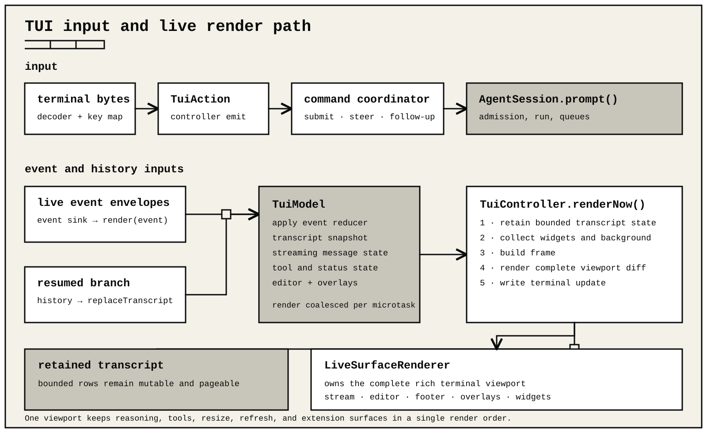

# Terminal UI

rigyn's interactive mode owns one terminal viewport with a retained transcript, a word-wrapped composer, and a compact two-row status dock. User messages use a full-width gray card with one row and one cell of inner padding by default. The dock can show workspace, session, live work, model, reasoning, tokens, cache, cost, and context pressure.

The built-in composer uses plain full-width rails and no fixed prompt label. Interactive questions display their prompt separately. A positioned terminal cursor marks the exact insertion point by default. Set `showHardwareCursor: false` to hide it; when that setting is omitted, `RIGYN_HARDWARE_CURSOR=0` also hides it. Up and Down wrap across both ends of the `/` command suggestions. The first dock row shows the current public phase, elapsed time, retry countdown, and cancel hint while work is active; otherwise it shows workspace and session state. The second row keeps the model and thinking level together, then adds context, token, cache, and cost fields as room permits. `in` is prompt/context input, including separately reported cache reads and writes; `out` is generated output. Both labels present the best available session total without an exactness glyph; extension snapshots retain separate exact and reported fields. `last cache N.N%` is the newest completed non-summary request's exact provider-reported cache-read share, while `last cache n/a` means that request omitted the required telemetry. It advances when that response completes and remains on the prior completed request while a new response is streaming. No cache chip appears before the first metered observation. `ctx N.N%` presents the current occupancy without a source glyph; extension snapshots retain whether it is provider-observed or projected. Narrow terminals omit whole low-priority fields instead of printing partial values.

The model picker and reasoning-level cycle remain available while a response is active. Each accepted operation keeps its original model-and-reasoning tuple. A selection made during that response becomes the session selection for the next accepted operation, including a queued follow-up; it does not change or relabel the provider request already in flight. An explicitly installed low-level `agent.prepareNextTurn` hook may intentionally select the tuple for a later provider turn inside that operation.

On a raw TTY, rigyn enters its rich alternate-screen viewport automatically. There is no surface setting or mode flag. Vertical mouse-wheel input scrolls the retained transcript, and the scrollbar can be dragged. Page Up and Page Down move by a viewport, Ctrl+Home and Ctrl+End move to its limits, and Ctrl+Shift+Up or Ctrl+Shift+Down move between marked user and final assistant messages. A left-button drag selects complete graphemes and copies at most 75,000 bytes; reaching a transcript edge continues the scroll. A successful copy clears the highlight and shows a short-lived popup, while a failed copy retains the selection and reports a warning. Losing terminal focus cancels an unfinished drag. A click can open a validated `http`, `https`, or `mailto` link. A drag never opens a link. Horizontal wheel input is ignored. On shutdown, rigyn disables mouse, focus, keyboard, paste, and terminal protocols before restoring the normal screen. The retained transcript is bounded to 2,000 entries and 2 MiB.

`older transcript` is a scroll-position marker: retained rows still exist above
the current viewport, and `Ctrl+Home` reaches their top. When space permits, the
same bounded row includes the collapsed user prompt that owns the visible
transcript section. It is distinct from the explicit `Older transcript entries
were discarded from the viewport` notice, which appears only after the
retained-entry or byte ceiling evicts old viewport rows. The durable V4 journal
remains complete; use `/export` when archival history beyond the bounded
interactive viewport is required.

In the rich viewport, transient informational notices such as model, refresh,
session, export, and extension reports remain readable until the next model run
starts. That run removes those status rows; warnings,
errors, durable messages, tool cards, and compaction receipts remain.
Append-only compatibility output cannot retract lines it has already written.



When raw terminal control is unavailable, rigyn automatically uses bounded line output. `RIGYN_ACCESSIBLE=1` requests the control-sequence-free accessibility path. `RIGYN_ASCII=1` selects ASCII glyphs. These are compatibility fallbacks, not alternate interactive layouts.

Presentation settings live in `config.json`. `/refresh` blocks input while it replaces the runtime generation, then rebuilds the active transcript from the same `SessionManager`. Stable scrollback is not moved through the mutable renderer. `/hotkeys` reports the active key map, including user overrides.

## Input, events, and rendering

Terminal bytes are decoded into key events and then `TuiAction` values. The interactive command coordinator routes submit, steer, follow-up, abort, picker, and editor actions. A submitted prompt eventually calls `AgentSession.prompt()`.

While a run is active, submitting ordinary text immediately shows a bounded
`Steering:` row; Alt+Enter or `/follow` shows a `Follow-up:` row. Attachment
counts remain visible with that receipt. The durable queue snapshot replaces
the local receipt without duplicating it, and the row disappears when the
message becomes a durable user entry, is restored to the editor, the run
rejects the queued delivery, settles before accepting it, or the session is
replaced.

Built-in slash commands do not wait behind the active response. View and
configuration commands run immediately; `/logout`, `/import`, `/fork`,
`/clone`, `/new`, `/compact`, `/resume`, `/recover`, `/refresh`, and
`/quit` first cancel the current turn and then run against the settled session.
`/tree` opens without cancelling; choosing a target cancels and recovers the
exact active operation before navigation, while closing the picker leaves the
run untouched.
`/cancel` and `/follow` retain their direct active-turn behavior. A second local
command receives an immediate busy warning, while extension prompts, extension
commands, and shell shortcuts keep their bounded deferred-queue behavior.

Escape cancels the active turn once. Queued user input is restored to the
editor before cancellation. If a tool crossed its durable dispatch boundary,
the cancelled turn can remain suspended because its outcome is uncertain.
Once that same-process cancellation has settled, the next submission records
unfinished effects as abandoned and continues without replaying them. A
failed recovery leaves the submission unsent and reports that `/recover` is
required. Startup never guesses an uncertain outcome. Typing bare `/recover`
first retries repeatable or reconcilable work, then records every effect still
blocked as abandoned without replay and unlocks the session. The notice lists
that non-replay decision; it does not claim the external action succeeded or
failed. `/recover abandon EFFECT_ID` remains available for one-effect control.

Output reaches the UI through two paths:

- live `AgentSession` event envelopes call `TuiController.render(event)`;
- resumed branch history calls `replaceTranscript()`.

Both update `TuiModel`. Ordinary UI changes are coalesced into a microtask; high-rate answer, reasoning, tool-argument,
and tool-progress deltas yield after 32 buffered events or once 8 milliseconds of processing accumulates, and are paced to at most one rich redraw every 16 milliseconds.
Wheel, Page Up, scrollbar-drag, and Escape input can promote a pending stream frame immediately.
`TuiController.renderNow()` builds the current frame and sends it to `LiveSurfaceRenderer`.

`LiveSurfaceRenderer` owns the complete rich viewport. No transcript row is irreversibly written while it can still change. This is the key invariant for resize, stream updates, `/refresh`, reasoning visibility, tool expansion, and shrink-to-empty repainting.

Reasoning rows contain only provider-authorized visible reasoning. Provider-supplied summaries remain summaries;
raw public thinking such as Kimi or DeepSeek `reasoning_content` remains raw and is not rewritten into a summary.
Provider traces and opaque reasoning state are not rendered. The transcript preserves the provider-authorized source
order of visible reasoning, answer, and tool blocks.
Transient live fragments are removed when a response completes. Refresh and resume reconstruct the same order from
durable history.

Visible reasoning streams inside a bordered `Thinking…` block and remains visible after completion. In the rich
viewport, `Ctrl+T` collapses or expands all live and completed reasoning blocks. Newly arriving reasoning follows that
choice until `Ctrl+T` toggles it again. Opaque, redacted, or provider-private reasoning is never shown.

### Live stream behavior

The rich viewport updates mutable answer, visible reasoning, and tool rows as events arrive. One tool card is
kept for the complete call lifecycle: pending argument collection, queued, running progress, completed, failed, or
in-doubt. Its full-width header carries the lifecycle band while continuation rows remain compact and use a state rail;
operation names, paths, and diff spans retain their semantic styling. A collapsed active Write card shows its target,
received-byte state, and at most the newest three sanitized source rows. Its final `Ctrl+O` affordance appears only when
earlier source is retained; expansion switches immediately to the bounded retained head and tail. A collapsed active
Edit card shows only its target and state. Expanding it reveals only complete old/new replacement pairs that the partial
argument parser has already converted into a bounded semantic preview; incomplete fields and raw argument JSON stay
hidden. Unknown extension tools use a bounded newest-input fallback unless they provide a semantic renderer. Completed
answer and reasoning rows become durable.

Completed and extension-provided tool detail follows these viewport limits:

| Tool | Collapsed detail | Expanded detail |
| --- | --- | --- |
| Write | First three source rows, with an expansion hint only when more is retained | Bounded source head and tail |
| Edit | Bounded authoritative diff | Bounded larger diff |
| Bash | Command plus latest five output rows | Latest retained output, bounded to 120 rows |
| Read | First ten result rows | First retained result rows, bounded to 120 rows |
| Grep | First fifteen result rows | First retained result rows, bounded to 120 rows |
| Find / ls | First twenty result rows | First retained result rows, bounded to 120 rows |
| Unknown extension tool | Bounded semantic input/output preview | Bounded retained head and tail, at most 120 rows per section |

Bash command headers occupy at most two visual rows. Omission markers distinguish collapsed detail that can be expanded
from expanded detail that remains intentionally bounded. A collapsed tool card shows at most one `Ctrl+O` affordance,
always as its final detail row; the expanded marker never misleadingly suggests `Ctrl+O`.
Model-invoked Bash cards prefix the command with a visual shell prompt, for example `$ npm test`; the `$` is not part of
the command sent to Bash. Startup help, skill and summary cards, and rendererless extension-message fallbacks use the
same 120-row expanded ceiling. Exceptionally long individual Markdown or output lines are sampled before parsing and
cell measurement and carry an explicit retained-content marker.

The automatic plain and accessibility fallbacks use bounded append-only text for the same lifecycle. Answer text may be held briefly so a
pending visible reasoning block can be printed first. Opaque or redacted reasoning is never printed. If answer text is
already visible, later reasoning is omitted because append-only output cannot insert it earlier. A context-limit attempt
is discarded; an output-token-limit finish keeps partial text and adds a warning. Resumed history uses canonical order.

## Direct extension UI

Event, tool, command, and shortcut callback contexts expose UI as `context.ui`. The activation-time `ExtensionAPI` has no global UI namespace.

Check `context.hasUI` before requiring interaction. Print, JSON, serve, and embedding hosts do not emulate terminal components.

The context supports:

- `notify`, status, title, working-message, and working-indicator updates;
- text or component widgets above or below the editor;
- complete header and footer component factories;
- select, confirm, input, and external-editor dialogs;
- editor text read/write and paste;
- raw terminal-input observation and bounded rewriting;
- autocomplete wrapping and complete editor replacement;
- resolved theme inspection, source-path discovery, and custom-theme selection;
- completed-tool expansion inspection and override;
- a persistent content-safe background plane;
- `custom` components and overlays.

UI registrations belong to one runtime generation. Failed activation, refresh, host reset, and shutdown remove stale registrations and reveal the nearest surviving owner. An extension-owned timer, watcher, socket, or other resource still needs `rigyn.onDispose`.

`setStatus(key, text)` contributes compact text to the shared work row in the status dock; values from multiple keys are joined and width-bounded. It is not an independently placed content row. Use `setWidget(key, value, { placement })` for a dedicated block above or below the editor.

See [`ui-surfaces`](../examples/ui-surfaces/README.md) for widgets and overlays and [`raw-editor-ui`](../examples/raw-editor-ui/README.md) for editor replacement.

## Components

Trusted packages import components and types from `rigyn/tui`:

```js
import { Text } from "rigyn/tui";

rigyn.registerCommand("status-panel", {
  async handler(_args, context) {
    context.ui.setHeader(() => new Text("Build ready", 1, 0));
    context.ui.setWidget("build", ["No pending work"], { placement: "aboveEditor" });
  },
});
```

There are two main rendering families—trusted raw components and bounded runtime components—with specialized contracts:

| Contract | Output | Intended host |
| --- | --- | --- |
| `Component` | `render(width): string[]`, optional raw `handleInput(data)`, and `invalidate()` | Explicitly trusted direct extensions using `context.ui` |
| `EditorComponent` | `Component` plus text, change, and submit methods | Complete direct-editor replacement |
| `BackgroundComponent` | `render(width, height): BackgroundCell[]`, `invalidate()`, and optional `dispose()` | The content-safe full-TUI background plane |
| `RuntimeUiComponent` | A bounded `RuntimeUiBlock` of text spans and theme roles, plus optional decoded-key handling | `TuiController` and `NativeUiHost` integrations |
| `RuntimeUiComponentFactory<T>` | Receives an abortable host with `requestRender()` and `close(value)` | Bounded custom, overlay, and persistent mounts |

Raw `Component` output may contain trusted terminal styling and terminal images. `RuntimeUiComponent` output is sanitized, clipped to the supplied width, and limited to 128 lines, 256 KiB, and 256 spans per line by default. Prefer the bounded contract unless the package genuinely needs raw terminal rendering.

### Public component catalog

All of these names are exported from `rigyn/tui`:

| Group | Components |
| --- | --- |
| Host container | `TUI`, `FullscreenTUI` |
| Layout and text | `Container`, `HStack`, `VStack`, `ScrollView`, `Box`, `Text`, `Markdown`, `Spacer`, `TruncatedText`, `Image` |
| Input and selection | `Input`, `Editor`, `SelectList`, `SettingsList` |
| Progress | `Loader`, `CancellableLoader` |
| Messages | `AssistantMessageComponent`, `UserMessageComponent`, `BranchSummaryMessageComponent`, `CompactionSummaryMessageComponent`, `SkillInvocationMessageComponent`, `CustomMessageComponent` |
| Extension interaction | `DynamicBorder`, `BorderedLoader`, `CustomEditor`, `ExtensionInputComponent`, `ExtensionEditorComponent`, `ExtensionSelectorComponent` |
| Selectors | `ThinkingSelectorComponent`, `ShowImagesSelectorComponent`, `ThemeSelectorComponent`, `UserMessageSelectorComponent`, `ModelSelectorComponent`, `OAuthSelectorComponent`, `SessionSelectorComponent`, `TreeSelectorComponent`, `SettingsSelectorComponent` |
| Execution and status | `BashExecutionComponent`, `ToolExecutionComponent`, `FooterComponent`, `LoginDialogComponent` |

`renderDiff()` and `truncateToVisualLines()` are the transcript helpers. Low-level viewport code can use `renderViewport()`, `fitViewportRows()`, `isViewportComponent()`, `compositeTerminalLine()`, and `compositeTerminalRows()`. Theme constructors, editor/select-list themes, keybinding managers, image helpers, and their option types are exported from the same subpath.

`UserMessageComponent` uses the same full-width gray card, vertical padding, and width-aware Markdown transformation as the shipping transcript. `AssistantMessageComponent` accepts the same optional transformer list and passes the live streaming state and available content width. Display-transform failures leave the source message readable.

Rigyn itself has one fixed rich interactive layout; it does not offer main-screen and alternate-screen layout modes. At the lower-level `@rigyn/terminal` layer, `TUI` is the main-screen host and `FullscreenTUI` is an alternate-screen host for a single root component. `TuiMainScreen` aliases `TUI`, and `TuiAltScreen` aliases `FullscreenTUI`. `TuiAltScreenOptions` aliases `FullscreenTUIOptions`. `setLayoutRoot()` aliases `setRoot()`. `ViewportTUI` describes that root-replacement capability, and `isViewportTUI()` detects it. Use a stack as that root to divide the terminal into regions. A `ScrollView` owns one vertical viewport and supports follow-to-end, pointer-targeted chained or contained overscroll, and hidden, automatic, or persistent draggable scrollbars. Symbol-marked `ViewportPointerTarget` and `ViewportPointerRegionComponent` contracts let custom layouts join the same hit-testing path. `ScrollViewScrollbar` aliases its scrollbar policy type, and `compositeTuiLine()` aliases `compositeTerminalLine()`. These hosts are for standalone trusted terminal applications; an extension running inside rigyn must use the host supplied through `context.ui`.

### Persistent slots

Direct extension mounts are keyed and owned by the active extension generation:

Rigyn renders its own built-in footer; it does not reuse or detect a shell prompt or terminal font. The footer shows
live workspace, release, session, activity, model, thinking, token, cache, cost, and context values. `setStatus` adds
compact text to its shared status row, while `setFooter` replaces the complete footer.

| Method | Slot and behavior |
| --- | --- |
| `setStatus(key, text)` | Adds or replaces compact keyed text in the shared status-dock work row; passing `undefined` removes it. |
| `setWidget(key, value)` | Adds or replaces one keyed widget above the editor. Use `{ placement: "belowEditor" }` for the lower slot. Moving a key removes it from its previous slot. A string-array value is rendered as text; a factory receives the live `TUI` and `Theme`. |
| `setHeader(factory)` | Installs this extension's complete header replacement. |
| `setFooter(factory)` | Installs this extension's complete footer replacement. The factory also receives `ReadonlyFooterDataProvider`. |
| `setEditorComponent(factory)` | Pushes a complete `EditorComponent` replacement while preserving the current draft. `getEditorComponent()` reports the globally active factory. |
| `setBackground(factory)` | Installs this extension's background owner in the rich viewport. |

Passing `undefined` removes that registration. Replacement, editor, and background slots reveal the newest surviving owner. Separately keyed widgets remain independently mounted.

Call `data.getSnapshot()` in a footer factory to read the live workspace, session, release, run activity, working
indicator, usage, cache, cost, context, compaction, provider, model, and thinking values. Exact and reported input
and output fields are separate; `promptInputTokens` includes cache traffic, while `promptInputTokensReported` is its
known lower bound. `contextSource` distinguishes provider-observed from estimated occupancy, and
`autoCompactionThresholdPercent` exposes the active trigger. The snapshot does not contain credentials.

The reusable `FooterComponent` follows the built-in active-branch presentation: exact and reported `in` and `out`
counters use the same plain labels, and cache is the newest completed non-summary assistant/model request's
`last cache N.N%` or `last cache n/a`. It shows no cache label before the session has a metered observation. Aggregate
cache counters remain available in the snapshot.

`data.getGitBranch()` returns the cached branch and schedules its bounded refresh;
`data.onBranchChange(callback)` subscribes to branch changes. `data.getExtensionStatuses()` returns shared keyed
status text, and `data.getAvailableProviderCount()` returns the live provider count. Footer components should use
`theme.unicode` and `theme.glyphs` for the host's Unicode or ASCII presentation.

Replacement or removal disposes the component once. Each raw or bounded persistent slot accepts at most 16 mounted owners. Component source is bounded to 128 lines and 256 KiB. Each displayed persistent block is reduced to four rows plus an overflow row.

### Focus and overlays

`Focusable` is the public `{ focused: boolean }` contract. `TUI.setFocus(component)` clears the previous focus, updates both `focused` flags, and routes raw input to the focused component. `TUI.setFocus(null)` returns input to the host. A `Component` without `focused` can still receive input when explicitly focused.

`context.ui.custom(factory, options)` receives the live TUI, resolved theme, active keybindings, and a `done(result)` callback. The factory returns a `Component` and may return a promise. Set `overlay: true` for an overlay and provide bounded `overlayOptions` when positioning or sizing it.

Without `overlay`, the component occupies the custom interaction surface. A normal component and a capturing overlay take focus; an overlay with `{ nonCapturing: true }` leaves focus where it was. A `visible(columns, rows)` predicate can hide an overlay responsively. When a focused overlay is hidden, closed, or becomes invisible, the controller restores the newest eligible owner or its prior focus.

`overlayOptions` supports the nine `OverlayAnchor` values, numeric or percentage `width`, `maxHeight`, `row`, and `col`, plus `minWidth`, `margin`, `offsetX`, `offsetY`, `visible`, and `nonCapturing`. `onHandle(handle)` exposes:

| Handle method | Effect |
| --- | --- |
| `hide()` | Permanently closes the mount; this is the compatibility alias for close. |
| `setHidden(true)` / `setHidden(false)` | Temporarily hides or reveals the mount without discarding its state. |
| `isHidden()` | Reports temporary hiding or closure. |
| `focus()` | Focuses a visible capturing mount and raises its focus order. |
| `unfocus()` | Restores the next eligible owner. `unfocus({ target })` selects an explicit active target or `null`. |
| `isFocused()` | Reports current live focus. |

`custom()` resolves with the value passed to `done()`. Generation abort resolves it with `undefined` and disposes the component. A raw custom component that implements `handleInput` consumes the input delivered to it, so it must implement its own confirm and cancel controls. Bounded `RuntimeUiComponent.handleKey()` instead returns whether it handled the decoded key; an unhandled Escape or `Ctrl+C` closes a focused bounded custom component or overlay.

A component must render quickly and deterministically. Perform I/O outside `render()`, invalidate only after state changes, and release component-owned work on disposal. The host owns terminal teardown, resize, focus transfer, and final screen restoration.

`context.ui.setBackground(factory)` installs a generation-owned `BackgroundComponent`; passing `undefined` clears that extension's background and reveals the nearest surviving owner. Its `render(width, height)` method receives the current terminal dimensions and returns zero-based `{ row, column, text }` cells. Each `text` must be exactly one printable, single-column grapheme. The host applies the theme's muted role, rejects terminal controls, and draws a cell only when the transcript, editor, overlays, and terminal images leave that position unoccupied. There is no alpha or background-color blending.

```js
context.ui.setBackground(() => ({
  render(width, height) {
    return width < 24 || height < 6 ? [] : [
      { row: 1, column: width - 3, text: "·" },
      { row: 2, column: width - 2, text: "·" },
    ];
  },
  invalidate() {},
}));
```

The rich viewport exposes the complete terminal plane. Resize invalidates the active component. Clear, refresh, failure, and shutdown repaint stale cells through the normal differential renderer.

Only the newest surviving background owner is rendered. A frame cannot contain more cells than the terminal plane, duplicate coordinates, out-of-bounds cells, or more than 2 MiB of cell text.

Invalid output removes and disposes that owner, reports a warning, and reveals the previous owner. Background factories do not run in line-output fallbacks.

## Editor and autocomplete

`context.ui.addAutocompleteProvider(factory)` wraps the current `AutocompleteProvider` for the active generation. The factory receives the provider installed before it and must return an object with `getSuggestions()` and `applyCompletion()`.

- `getSuggestions(lines, cursorLine, cursorCol, { signal, force })` uses normal JavaScript string offsets for `cursorCol`. Automatic trigger-character requests use `force: false`; Tab requests use `force: true`.
- `triggerCharacters` from every wrapper are unioned, so adding a trigger does not erase an earlier trigger.
- `shouldTriggerFileCompletion()` can suppress forced file completion. Preserve or call the previous predicate unless replacement is intentional.
- `applyCompletion()` returns the complete updated line array and cursor. The host converts its edit back to a grapheme-indexed replacement, so emoji and combining sequences remain aligned.
- The host cancels an outstanding request when input, provider ownership, or generation changes. Results are limited to 256 items; values are limited to 64 KiB, labels to 4 KiB, and descriptions to 16 KiB.

Typing `/` into an empty full-TUI editor opens command completion, `@` at a token boundary opens workspace-file selection, and Tab tries the active provider before command and file fallbacks.

`context.ui.setEditorComponent(factory)` replaces the complete editor. The factory receives the live TUI, editor theme, and keybinding manager. A replacement must preserve submission, cancellation, paste, resize, focus, accessibility, and host keybindings. Passing `undefined` restores the previous owner.

`context.ui.onTerminalInput(handler)` can consume or rewrite terminal input before normal editing. It is a high-authority trusted hook. Do not record secret input, trap exit or cancel behavior, or return unbounded rewrites.

## Programmatic and native hosts

`TuiController` exposes the bounded host surface directly: `custom()`, `showOverlay()`, `setPersistentComponent()`, `setAutocompleteProvider()`, and `setEditorMiddleware()`. These methods retain host ownership of decoding, rendering, resize, and teardown.

`createNativeUiHost(controllerBridge, extensionId, generationSignal)` creates the narrower `NativeUiHost` used by interactive host integrations. It is not needed inside a normal extension callback, where `context.ui` is already bound.

| `NativeUiHost` area | Methods |
| --- | --- |
| Lifecycle | Read-only `extensionId` and combined `signal`; idempotent `dispose()` |
| Decoded input | `onInput(handler)` with `pass`, `consume`, or rewritten `KeyEvent` |
| Editor | `getEditor()`, `replaceEditor()`, `wrapEditor()`, `pasteToEditor()` |
| Persistent components | `mountHeader()`, `mountFooter()`, `mountWidget(factory, "above" \| "below")`, `replaceHeader()`, `replaceFooter()` |
| Autocomplete | `wrapAutocomplete()` |
| Theme | `currentTheme()`, `themeCatalog()`, `applyTheme()` |

Every registration or installation method returns an idempotent disposer. Disposal or generation abort removes only that registration. Stacked editor, theme, autocomplete, and replacement state falls back to its predecessor. Component factories use `RuntimeUiComponentFactory`, not raw terminal strings.

`createUnsafeTerminalHost()` is a separate, explicitly unsafe integration surface. It exposes raw `onInput()`, `write()`, `requestRender()`, terminal `size()`, `capabilities()`, and active `keybindings()`. Raw writes are limited to 1 MiB and may invalidate the current frame; call `requestRender()` after an out-of-band terminal protocol. Neither native host is available after terminal teardown or in a noninteractive host.

## Themes

`context.ui.theme` is the current resolved theme. `getAllThemes`, `getTheme`, and `setTheme` operate on the built-in `mono` and `signal` themes plus validated discovered custom themes, and custom package themes include their source path. A successful selection in the interactive host updates the live renderer and the user's theme setting; headless hosts cannot persist a terminal selection. Terminal-control data in custom theme values is rejected by the loader.

The explicitly trusted direct TUI is the public TUI runtime backed by the active host renderer. Its dimensions, enhanced-keyboard state, color-scheme notifications and queries, background-color query, redraw count, cursor preference, and clear-on-shrink preference reflect live host state. `start()` and `stop()` pause only the extension generation's components and input listeners; they never take ownership of the process terminal. Forced redraws, input draining, and raw terminal callbacks use the existing controller and expire with the extension generation.

## Tool and session rendering

Tool rendering is declared with the tool itself:

```js
rigyn.registerTool({
  name: "example",
  label: "Example",
  description: "Return a value",
  parameters: { type: "object", additionalProperties: false, properties: {} },
  async execute() {
    return { content: [{ type: "text", text: "ready" }], details: {} };
  },
  renderCall(_args, _theme, renderer) {
    return new Text(renderer.isPartial ? "Example…" : "Example", 0, 0);
  },
  renderResult(result) {
    return new Text(result.content[0]?.type === "text" ? result.content[0].text : "ready", 0, 0);
  },
});
```

Renderers supplement model-visible observations; they do not replace them. Always return useful bounded text or image content from the tool. Missing, expired, or failing renderers fall back to native presentation.

`registerMessageRenderer(customType, renderer)` and `registerEntryRenderer(customType, renderer)` render custom messages and append-only custom session entries. Live appends and resumed history use the same JSONL entries, stable entry IDs, and branch order. `display: false` messages never enter the transcript. The host resolves the active renderer generation on every redraw, including after refresh, theme changes, and terminal resize. Missing, expired, invalid, or throwing renderers fall back to bounded terminal-safe text; renderer-only details and custom-entry data are not copied into that fallback. Transcript presentation retains at most 2,000 entries and 2 MiB.

A renderer must be a pure projection of the stored value and supplied theme so resumed sessions do not depend on lost in-memory state. Test both live append and resume, narrow and wide Unicode layouts, refresh, hidden messages, and a deliberate render exception.

## Headless behavior

`context.hasUI` means dialogs can be requested. It does not promise the full terminal component renderer.

| Host | `hasUI` | Available behavior |
| --- | --- | --- |
| Rich interactive viewport | `true` | Dialogs, editor state, themes, raw and bounded components, overlays, autocomplete, backgrounds, and tool expansion |
| Automatic line or accessibility fallback | `true` | Searchable numbered prompts for `/settings`, `/scoped-models`, model and session selection, `/tree`, dialogs, notifications, and core editor interaction; rich overlay filtering, tree folding, and model reordering require the rich viewport; component mounts are rejected or ignored according to the method, and backgrounds are not invoked |
| RPC | `true` | Bridged select/confirm/input/editor requests plus notifications, status, text widgets, title, and editor-text records; no terminal components, autocomplete replacement, background, or theme switching |
| Print, JSON, or embedding | `false` | Dialogs return cancellation defaults, editor text is empty, presentation setters are no-ops, and terminal factories are not installed |

The noninteractive fallback theme is colorless, non-Unicode `mono`; its theme catalog is empty, editor replacement is unobservable, and `setTheme()` returns `{ success: false, error: "Interactive UI is unavailable" }`. `select()`, `input()`, and `editor()` resolve without a value, `confirm()` resolves to `false`, `getEditorText()` returns an empty string, and `getToolsExpanded()` returns `false`. Presentation and terminal-component setters do not invoke supplied factories. RPC exposes its own colorless `mono` projection and returns a mode-specific theme-switching error.

A command that fundamentally requires a dialog or overlay should report that requirement and stop safely when `context.hasUI` is false. If it specifically requires a component or terminal protocol, it must also require the rich interactive viewport. Model-controlled input is never user approval; destructive actions require an actual confirmation interaction.

## Lifecycle checklist

1. Propagate callback and generation cancellation.
2. Never retain a UI context, component, or API object after refresh.
3. Keep rendered data bounded and terminal-safe.
4. Make component cleanup idempotent.
5. Test narrow/wide resize, Unicode, cancellation, refresh, and a render exception.
6. Test a safe headless result for every interactive command.

From the repository root, run the source example with `rigyn --extension ./packages/rigyn/examples/ui-surfaces/extensions/index.mjs`, then exercise its commands in a real PTY. Distributable packages should also test the exact packed and installed artifact.
